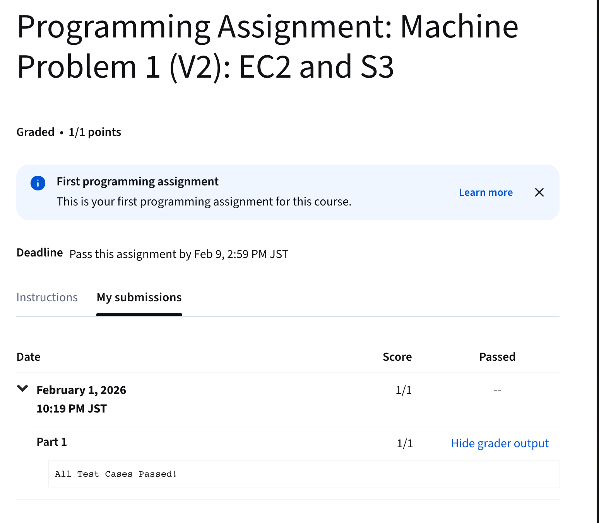

# MP1 v2 - EC2 and S3

## Overview

1. Launch an EC2 instance and configure it with an IAM role that has S3 access
2. Write a Python script to process CSV data from S3. 
    - Download a CSV file of orders from a public S3 bucket
    - Filter the data based on specific conditions
    - Upload the filtered results to your own S3 bucket. 
3. Run a submission script that will verify your setup and your filtered results.

## 0. Environment Setup 

```bash
# ensure the aws cli is installed
aws --version

# export the profile to use
export AWS_PROFILE=<profile-name>

# check the profile is set
aws sts get-caller-identity
aws configure get region
```

---

## 1. Create an IAM role

### 1-1. Create an IAM Role policy for the EC2 instances

- This is saved as `iam-assume-role-policy.json`

```json 
{
  "Version": "2012-10-17",
  "Statement": [
    {
      "Effect": "Allow",
      "Principal": {
        "Service": "ec2.amazonaws.com"
      },
      "Action": "sts:AssumeRole"
    }
  ]
}
```
- `"Service": "ec2.amazonaws.com"`: Allows all the **EC2** instances attached with this role to perform the following actions
- `"Action": "sts:AssumeRole"`: Allows the **EC2** instance with this role to call **AWS STS (AWS Security Token Service)** to get a temporary credential for this role.

### 1-2. Create an IAM role with the policy

```bash
aws iam create-role \
  --role-name role-name-here \
  --assume-role-policy-document file://iam-assume-role-policy.json
```

> [!WARNING]
> 
> Don't forget to add `file://` protocol before your file path

### 1-3. Attach all the necessary AWS-managed policies to the role for later access of other services

```bash
for policy in \
  arn:aws:iam::aws:policy/AmazonS3FullAccess \
  arn:aws:iam::aws:policy/AmazonEC2ReadOnlyAccess \
  arn:aws:iam::aws:policy/AmazonSSMManagedInstanceCore \
  arn:aws:iam::aws:policy/IAMReadOnlyAccess
do
  aws iam attach-role-policy \
    --role-name role-name-here \
    --policy $policy
done
```

### 1-4. Ensure all the policies are attached

```bash
aws iam list-attached-role-policies --role-name ec2-role
```

- You should see a response like this:

```json
{
    "AttachedPolicies": [
        {
            "PolicyName": "AmazonEC2ReadOnlyAccess",
            "PolicyArn": "arn:aws:iam::aws:policy/AmazonEC2ReadOnlyAccess"
        },
        {
            "PolicyName": "AmazonSSMManagedInstanceCore",
            "PolicyArn": "arn:aws:iam::aws:policy/AmazonSSMManagedInstanceCore"
        },
        {
            "PolicyName": "IAMReadOnlyAccess",
            "PolicyArn": "arn:aws:iam::aws:policy/IAMReadOnlyAccess"
        },
        {
            "PolicyName": "AmazonS3FullAccess",
            "PolicyArn": "arn:aws:iam::aws:policy/AmazonS3FullAccess"
        }
    ]
}
```


---

## 2. Set up an EC2 instance

### 2-1. Get an image for later EC2 instance credation

```bash
aws ec2 describe-images \
--owners amazon \
--filters "Name=name,Values=al2023-ami-*" \
--query "Images[*].[ImageId,Name]" \
--output table
```

- You should see an output like this

```bash
-------------------------------------------------------------------------------------------
|                                     DescribeImages                                      |
+------------------------+----------------------------------------------------------------+
|  ami-00ab017cba8471ebf |  al2023-ami-ecs-neuron-hvm-2023.0.20250821-kernel-6.1-x86_64   |
|  ami-00d65eac88e8a5816 |  al2023-ami-ecs-hvm-2023.0.20240312-kernel-6.1-arm64           |
|  ami-0096aa2831d78b30c |  al2023-ami-ecs-hvm-2023.0.20250516-kernel-6.1-x86_64          |
|  ami-0066fc6d0f069eeea |  al2023-ami-ecs-hvm-2023.0.20260108-kernel-6.1-x86_64          |
|  ami-00b51e1266717f944 |  al2023-ami-ecs-hvm-2023.0.20250613-kernel-6.1-arm64           |
|  ami-00afec874ecbf7b2c |  al2023-ami-ecs-neuron-hvm-2023.0.20241003-kernel-6.1-x86_64   |
...
```

- Copy an image id that you want to use. 
-  In my case, I chose `ami-06cce67a5893f85f9` as it does not require extra cost and support the instance type `t2.micro` (a free-tier instance).

### 2-2. Create a key pair for `SSH` connection

```bash
aws ec2 create-key-pair \
  --key-name my-keypair \
  --query "KeyMaterial" \
  --output text > my-keypair.pem
chmod 400 my-keypair.pem
```


### 2-3. Create a security group

```bash
aws ec2 create-security-group \
--group-name my-sg \
--description "SSH Access for EC2 instances"
```
- This allows you to specify the `user`, `protocol`, and `port` that your EC2 instance is allowed to have communication.

### 2-4. Specify the communication protocol to be `ssh`

```bash
aws ec2 authorize-security-group-ingress \
--group-name my-sg \
--protocol tcp \
--port 22 \
--cidr 0.0.0.0/0
```

### 2-5. Start an instance

```bash
aws ec2 run-instances \
--image-id  ami-06cce67a5893f85f9 \
--instance-type t2.micro \
--key-name my-keypair \
--security-groups my-sg \
--count 1 \
--tag-specifications "ResourceType=instance,Tags=[{Key=Name,Value=MyCLIInstance}]"
```

> [!TIP]
> 
> After you successfully create an instance, copy the instance id specified by `"InstanceId"`. It should be in the format of `i-XXXXXXXXXXXXXXXXX`.

### 2-6. Create an EC2 instance profile to attach the IAM role created

- Since `EC2` cannot attach `IAM roles` directly, we need an instance profile to attach the role to it.
- The chain is: 

```

EC2 instance
   ↓
Instance Profile
   ↓
IAM Role
   ↓
Permission Policies
```

#### 2-6-1. Create an profile

```bash
aws iam create-instance-profile --instance-profile ec2-profile
```

#### 2-6-2. Add the created role to the profile

```bash
aws iam add-role-to-instance-profile \
  --instance-profile ec2-profile \
  --role-name ec2-role
```

#### 2-6-3. Ensure the role is added

```bash
aws iam list-instance-profiles-for-role --role-name ec2-role
```

#### 2-6-3. Associate the profile to the instance 

- run

```bash
aws ec2 associate-iam-instance-profile \
    --instance-id i-XXXXXXXXXXXXXXXXX  \
    --iam-instance-profile Name="ec2-profile"

```

- You should see the following response

```json
{
    "IamInstanceProfileAssociation": {
        "AssociationId": "iip-assoc-XXXXXXXXXXXXXXXXX",
        "InstanceId": "i-XXXXXXXXXXXXXXXXX",
        "IamInstanceProfile": {
            "Arn": "arn:aws:iam::XXXXXXXXXXXX:instance-profile/ec2-profile",
            "Id": "XXXXXXXXXXXXXXXXXXXXX"
        },
        "State": "associating"
    }
}
```

---

## 3. Create an S3 Bucket

### 3-1. Create a bucket

```bash
aws s3 mb "s3://my-cca-bucket"
make_bucket: my-cca-bucket

```

### 3-2. Create a bucket policy to allow public access

- This is saved as `bucket-policy.json`

```json
{
  "Version": "2012-10-17",
  "Statement": [
    {
      "Sid": "PublicReadGetObject",
      "Effect": "Allow",
      "Principal": "*",
      "Action": "s3:GetObject",
      "Resource": "arn:aws:s3:::my-cca-bucket/*"
    }
  ]
}
```

### 3-3. Update s3 bucket's public access policy

```bash
# Turn off public access block first
aws s3api put-public-access-block \
  --bucket my-cca-bucket \
  --public-access-block-configuration \
  BlockPublicAcls=false,\
  IgnorePublicAcls=false,\
  BlockPublicPolicy=false,\
  RestrictPublicBuckets=false

# Add new policy to the s3 bucket
aws s3api put-bucket-policy \
  --bucket my-cca-bucket \
  --policy file://bucket-policy.json
```


### 3-4. Copy your `results.csv` to the bucket 

```bash
aws s3 cp results.csv "s3://my-cca-bucket/results.csv"
```

> [!NOTE]
> 
> If you haven't write the script for to generate the `results.csv`:
> - Get the file: `aws s3api get-object --bucket mp1-orders  --key orders.csv orders.csv`
> - Write your own python script to process the data and generate `results.csv`


## 4. Run the `submit.py` provided

### 4-1. Ensure that you have replaced the following content inside `submit.py`

```python
COURSERA_TOKEN = ""  # Replace with your Coursera token
S3_URI = "s3://my-cca-bucket/results.csv"  # Replace with your S3 URI
SUBMITTER_EMAIL = ""  # Replace with your email
```


### 4-2. Get your EC2 IPv4 Address

```bash
aws ec2 describe-instances \
--instance-id i-XXXXXXXXXXXXXXXXX \
--query "Reservations[0].Instances[0].PublicIpAddress" \
--output text
```

### 4-3. `scp` everything to the EC2 instance 

```bash
scp -i my-keypair.pem * ec2-user@xxx.xxx.xxx.xxx:/home/ec2-user/
```

> [!NOTE]
>
> - You can also only copy `submit.py` and `results.csv` to the instance. I'm being lazy here.
> - Remember to `chmod 400 my-keypair.pem`, so that you won't get `bad permissions` error.


### 4-4. `ssh` into the instance and run `sumbit.py`

- Run:

```bash
ssh -i ec2-keypair.pem ec2-user@xxx.xxx.xxx.xxx
python3 submit.py
```

- You should see:

```bash
Submitting assignment to autograder...
Submission successful!
Response Body: {"status": "PASS", "coursera_response": "Successfully posted to Coursera"}
```

- On **Coursera**, you will see:



## 5. Clean Up

> [!CAUTION]
> 
> Please ensure that your result is **REALLY UPLOADED** to **Cousera** before you move on to clean everything up. I did this assignment twice as I later on realized my work was not graded for the first time.

### Delete EC2 instance

- Run:

```bash
aws ec2 terminate-instances --instance-id i-XXXXXXXXXXXXXXXXX
```

- You should see:
```bash
{
    "TerminatingInstances": [
        {
            "InstanceId": "i-XXXXXXXXXXXXXXXXX",
            "CurrentState": {
                "Code": 32,
                "Name": "shutting-down"
            },
            "PreviousState": {
                "Code": 16,
                "Name": "running"
            }
        }
    ]
}

```

### Delete S3 bucket

```bash
aws s3 rb "s3://my-cca-bucket/" --force

```
